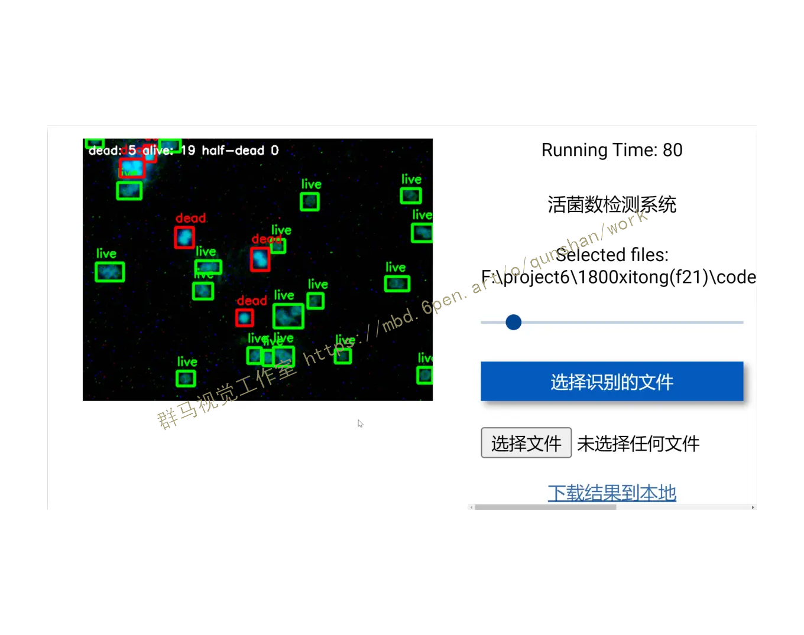
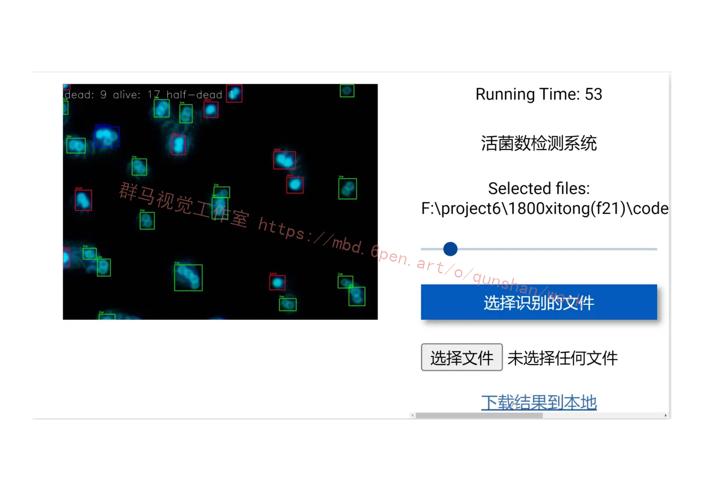
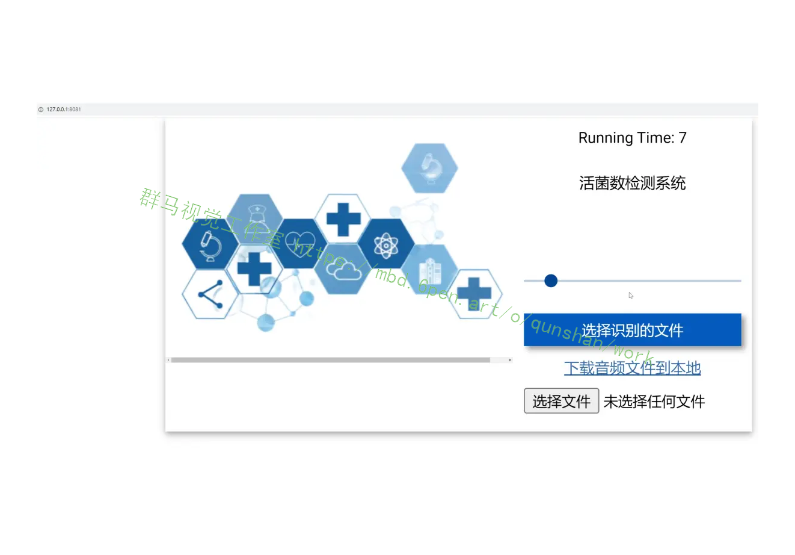
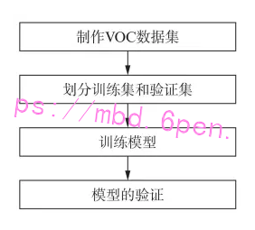
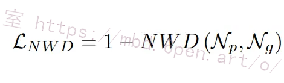
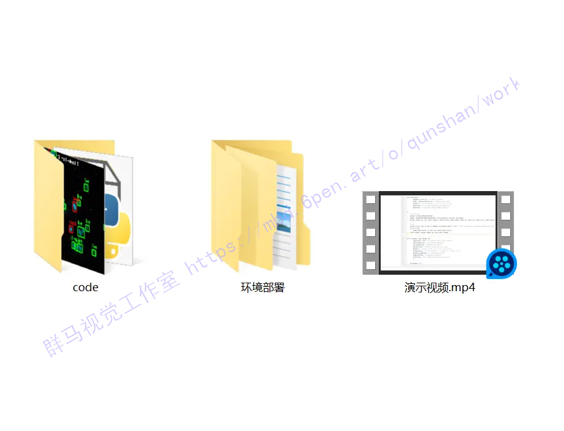


## 1.研究背景与意义

近年来，随着互联网和计算机技术的快速发展，人们对于基于Web的应用程序的需求也越来越高。在各个领域中，基于Web的应用程序已经成为了一种重要的工具，为人们提供了便利和效率。同时，随着生物技术的不断发展，活菌检测也成为了一个重要的研究领域。

活菌检测是指对于样本中的活菌进行鉴定和检测的过程。在医学、食品安全、环境监测等领域中，活菌检测都是非常重要的任务。传统的活菌检测方法往往需要耗费大量的时间和人力，而且存在着一定的误差。因此，开发一种基于Web的活菌检测系统，能够提高检测的准确性和效率，具有重要的意义。

在活菌检测领域中，YOLOv5是一种非常流行的目标检测算法。YOLOv5是YOLO（You Only Look Once）系列算法的最新版本，它采用了一种基于单阶段的目标检测方法，具有较高的检测速度和准确性。然而，传统的YOLOv5算法在活菌检测任务中存在一些问题，例如对于小尺寸的活菌检测效果不佳，对于复杂背景下的活菌检测也存在一定的困难。

因此，本研究旨在基于Web和改进YOLOv5算法，开发一种高效准确的活菌检测系统。具体来说，本研究将对YOLOv5算法进行改进，以提高其在活菌检测任务中的性能。同时，本研究将开发一个基于Web的应用程序，使得用户可以通过浏览器访问该系统，并上传待检测的活菌样本。系统将对样本进行检测和鉴定，并给出相应的结果和报告。

该活菌检测系统具有以下几个方面的意义：

1. 提高活菌检测的准确性：通过改进YOLOv5算法，提高其在活菌检测任务中的性能，能够更准确地检测和鉴定活菌样本，减少误判的可能性。

2. 提高活菌检测的效率：基于Web的应用程序能够方便用户上传待检测的活菌样本，并自动进行检测和鉴定，大大节省了人力和时间成本，提高了检测的效率。

3. 便捷的使用方式：用户可以通过浏览器访问该系统，无需安装额外的软件，使得使用更加便捷和灵活。

4. 推广和应用价值：该活菌检测系统可以广泛应用于医学、食品安全、环境监测等领域，为相关行业提供了一种高效准确的活菌检测工具，具有重要的推广和应用价值。

总之，基于Web和改进YOLOv5的活菌检测系统的研究具有重要的理论和实际意义。通过该系统的开发和应用，能够提高活菌检测的准确性和效率，为相关领域的研究和应用提供有力支持。

# 2.图片演示






# 3.视频演示
[基于Web和改进YOLOv5的活菌检测系统（源码＆部署教程）_哔哩哔哩_bilibili](https://www.bilibili.com/video/BV1Gh4y1T7UC/?vd_source=ff015de2d29cbe2a9cdbfa7064407a08)

# 4.程序实施步骤
本系统中的目标识别采用基于深度学习的YOLO v5模型架构。YOLO v5产生的模型一般十几兆,识别速度很快,可用于嵌入式设备。
YOLO的原理是将物体检测作为回归问题求解,基于1个单独的端到端( end-to-end>网络,完成从原始图像的输入到物体位置和类别的输出，YOLO训练和检测均在1个单独网络中进行。YOLO没有显示求取region proposal的过程,而R-CNN/Faster-R-CNN采用分离的模块(独立于网络之外的selective search方法)求取候选框,训练过程因此分成多个模块进行[3]。本系统中利用卷积神经网络,并在 PASCAL VOC检测数据集上对其进行评估,网络的初始卷积层从图像中提取特征,再通过模型预测输出概率和坐标。
YOLO v5程序实现步骤如图所示。识别的图片数据格式为jpg 或png,而制作VOC数据集
需要的是xml格式的特征标注文件。xml 格式的标注文件是用简单的标记对数据进行描述。
YOLO v5需要的是txt文件。本研究使用IabelImg框架进行手动标注数据,得到xml格式的标注文

件,并通过python程序转换为txt 文件。将所得的txt数据对半分,一半为训练集，一半为验证集，并通过官方的分类代码进行验证集和训练集的分类。训练模型采用的是 YOLO v5官方提供的YOLO v5s模型,训练次数为300 轮,其他参数采用默认参数。训练图如图6所示。训练环境的软件环境是anaconda搭建的pytorch环境并在pycharm中运行,物理环境是GTX1050Ti图形处理器,操作系统是 Windows 1o[6-7]。霉菌目标识别效果图如图7所示。


## 5.核心代码讲解

#### 5.1 web.py

```python


class ObjectDetector:
    def __init__(self, weights='./best.pt', data='./data/coco128.yaml', device='', half=False, dnn=False):
        self.device = select_device(device)
        self.model = self.load_model(weights, data, half, dnn)
        self.names = self.model.module.names if hasattr(self.model, 'module') else self.model.names

    def load_model(self, weights, data, half, dnn):
        device = select_device(self.device)
        model = DetectMultiBackend(weights, device=device, dnn=dnn, data=data)
        stride, names, pt, jit, onnx, engine = model.stride, model.names, model.pt, model.jit, model.onnx, model.engine

        half &= (pt or jit or onnx or engine) and device.type != 'cpu'
        if pt or jit:
            model.model.half() if half else model.model.float()
        return model

    def detect_objects(self, img, imgsz=(640, 640), conf_thres=0.25, iou_thres=0.05, max_det=1000, classes=None, agnostic_nms=False, augment=False, half=False):
        cal_detect = []

        im = letterbox(img, imgsz, self.model.stride, self.model.pt)[0]
        im = im.transpose((2, 0, 1))[::-1]
        im = np.ascontiguousarray(im)

        im = torch.from_numpy(im).to(self.device)
        im = im.half() if half else im.float()
        im /= 255
        if len(im.shape) == 3:
            im = im[None]

        pred = self.model(im, augment=augment)

        pred = non_max_suppression(pred, conf_thres, iou_thres, classes, agnostic_nms, max_det=max_det)

        for i, det in enumerate(pred):
            if len(det):
                det[:, :4] = scale_coords(im.shape[2:], det[:, :4], img.shape).round()

                for *xyxy, conf, cls in reversed(det):
                    c = int(cls)
                    label = f'{self.names[c]}'
                    cal_detect.append([label, xyxy, float(conf)])
        return cal_detect
```

这个程序文件是一个基于Remi库的GUI应用程序。它使用了OpenCV、PyTorch和其他一些库来进行图像识别和检测。主要包括以下几个部分：

1. 导入所需的库和模块。
2. 定义了一个函数`load_model`，用于加载模型。
3. 定义了一个函数`run`，用于运行模型进行图像识别和检测。
4. 定义了一个类`MyApp`，继承自Remi的`App`类，用于创建GUI应用程序。
5. 在`MyApp`类中，定义了一些回调函数和GUI组件，如按钮、标签、图像等。
6. 在`main`方法中，创建了GUI的布局，并设置了一些回调函数。
7. 最后，创建了一个`MyApp`对象，并启动应用程序。

整个程序的功能是一个活菌数检测系统，用户可以选择要识别的图像文件，然后系统会对图像进行识别和检测，并显示识别结果和活菌数。用户还可以调整一个滑动条来控制检测的阈值。

#### 5.2 yolov5-NWD.py

```python
import torch

class WassersteinLoss:
    def __init__(self, eps=1e-7, constant=12.8):
        self.eps = eps
        self.constant = constant

    def __call__(self, pred, target):
        center1 = pred[:, :2]
        center2 = target[:, :2]

        whs = center1[:, :2] - center2[:, :2]

        center_distance = whs[:, 0] * whs[:, 0] + whs[:, 1] * whs[:, 1] + self.eps

        w1 = pred[:, 2]  + self.eps
        h1 = pred[:, 3]  + self.eps
        w2 = target[:, 2] + self.eps
        h2 = target[:, 3] + self.eps

        wh_distance = ((w1 - w2) ** 2 + (h1 - h2) ** 2) / 4

        wasserstein_2 = center_distance + wh_distance
        return torch.exp(-torch.sqrt(wasserstein_2) / self.constant)
```

Usage:
```python
wasserstein_loss = WassersteinLoss()
nwd = wasserstein_loss(pbox, tbox[i]).squeeze()
iou_ratio = 0.5
lbox += (1 - iou_ratio) * (1.0 - nwd).mean() + iou_ratio * (1.0 - iou).mean()  # iou loss

# Objectness
iou = (iou.detach() * iou_ratio + nwd.detach() * (1 - iou_ratio)).clamp(0, 1).type(tobj.dtype)
```

这个程序文件名为yolov5-NWD.py，主要实现了一个名为wasserstein_loss的函数，用于计算目标检测中的损失函数。该函数的实现参考了论文《Enhancing Geometric Factors into Model Learning and Inference for Object Detection and Instance Segmentation》。

wasserstein_loss函数接受两个参数pred和target，分别表示预测的边界框和真实的边界框。其中，pred和target的形状都为(n, 4)，表示n个边界框，每个边界框由(x_center, y_center, w, h)四个值组成。

函数首先从pred和target中提取出中心点坐标center1和center2，然后计算中心点坐标之间的距离center_distance。接着，计算预测边界框的宽度w1和高度h1，以及真实边界框的宽度w2和高度h2。然后，计算宽度和高度之间的距离wh_distance。

最后，根据中心点距离和宽度高度距离计算wasserstein_2，并返回torch.exp(-torch.sqrt(wasserstein_2) / constant)作为损失值。

在主程序中，首先调用wasserstein_loss函数计算nwd，然后根据nwd和iou_ratio计算lbox的值。最后，根据iou和nwd的值计算iou_loss，并将其加到lbox上。最终得到的lbox即为目标检测的损失值。


#### 5.3 demo\create_result_gif.py

```python

class GifCreator:
    def __init__(self, image_dir, out='result.gif'):
        self.image_dir = image_dir
        self.out = out

    def _generate_batch_data(self, sampler, batch_size):
        batch = []
        for idx in sampler:
            batch.append(idx)
            if len(batch) == batch_size:
                yield batch
                batch = []
        if len(batch) > 0:
            yield batch

    def create_gif(self, frames, duration=2):
        """Create gif through imageio.

        Args:
            frames (list[ndarray]): Image frames
            duration (int): Display interval (s),
                Default: 2
        """
        if imageio is None:
            raise RuntimeError('imageio is not installed,'
                               'Please use “pip install imageio” to install')
        imageio.mimsave(self.out, frames, 'GIF', duration=duration)

    def create_frame_by_matplotlib(self, nrows=1, fig_size=(300, 300), font_size=15):
        """Create gif frame image through matplotlib.

        Args:
            nrows (int): Number of rows displayed, Default: 1
            fig_size (tuple): Figure size of the pyplot figure.
               Default: (300, 300)
            font_size (int): Font size of texts. Default: 15

        Returns:
            list[ndarray]: image frames
        """

        result_dir_names = os.listdir(self.image_dir)
        assert len(result_dir_names) == 2
        # Longer length has higher priority
        result_dir_names.reverse()

        images_list = []
        for dir_names in result_dir_names:
            images_list.append(mmcv.scandir(osp.join(self.image_dir, dir_names)))

        frames = []
        for paths in self._generate_batch_data(zip(*images_list), nrows):

            fig, axes = plt.subplots(nrows=nrows, ncols=2)
            fig.suptitle('Good/bad case selected according '
                         'to the COCO mAP of the single image')

            det_patch = mpatches.Patch(color='salmon', label='prediction')
            gt_patch = mpatches.Patch(color='royalblue', label='ground truth')
            # bbox_to_anchor may need to be finetuned
            plt.legend(
                handles=[det_patch, gt_patch],
                bbox_to_anchor=(1, -0.18),
                loc='lower right',
                borderaxespad=0.)

            if nrows == 1:
                axes = [axes]

            dpi = fig.get_dpi()
            # set fig size and margin
            fig.set_size_inches(
                (fig_size[0] * 2 + fig_size[0] // 20) / dpi,
                (fig_size[1] * nrows + fig_size[1] // 3) / dpi,
            )

            fig.tight_layout()
            # set subplot margin
            plt.subplots_adjust(
                hspace=.05,
                wspace=0.05,
                left=0.02,
                right=0.98,
                bottom=0.02,
                top=0.98)

            for i, (path_tuple, ax_tuple) in enumerate(zip(paths, axes)):
                image_path_left = osp.join(
                    osp.join(self.image_dir, result_dir_names[0], path_tuple[0]))
                image_path_right = osp.join(
                    osp.join(self.image_dir, result_dir_names[1], path_tuple[1]))
                image_left = mmcv.imread(image_path_left)
                image_left = mmcv.rgb2bgr(image_left)
                image_right = mmcv.imread(image_path_right)
                image_right = mmcv.rgb2bgr(image_right)

                if i == 0:
                    ax_tuple[0].set_title(
                        result_dir_names[0], fontdict={'size': font_size})
                    ax_tuple[1].set_title(
                        result_dir_names[1], fontdict={'size': font_size})
                ax_tuple[0].imshow(
                    image_left, extent=(0, *fig_size, 0), interpolation='bilinear')
                ax_tuple[0].axis('off')
                ax_tuple[1].imshow(
                    image_right,
                    extent=(0, *fig_size, 0),
                    interpolation='bilinear')
                ax_tuple[1].axis('off')

            canvas = fig.canvas
            s, (width, height) = canvas.print_to_buffer()
            buffer = np.frombuffer(s, dtype='uint8')
            img_rgba = buffer.reshape(height, width, 4)
            rgb, alpha = np.split(img_rgba, [3], axis=2)
            img = rgb.astype('uint8')

            frames.append(img)

        return frames

    def create_gif_from_images(self):
        frames = self.create_frame_by_matplotlib()
        self.create_gif(frames, self.out)

```

这个程序文件是用来创建GIF动画的。它首先通过命令行参数解析获取结果图像保存路径和输出GIF的路径。然后，它使用matplotlib和mmcv库来创建GIF动画。它会遍历结果图像保存路径下的两个子目录，读取每个子目录中的图像，并将它们按照指定的行数和图像大小创建成动画帧。最后，它使用imageio库将帧保存为GIF动画文件。

#### 5.5 demo\image_demo.py

```python

class ObjectDetector:
    def __init__(self, config, checkpoint, device='cuda:0', score_thr=0.3):
        self.config = config
        self.checkpoint = checkpoint
        self.device = device
        self.score_thr = score_thr

    def detect(self, img_path):
        model = init_detector(self.config, self.checkpoint, device=self.device)
        result = inference_detector(model, img_path)
        show_result_pyplot(model, img_path, result, score_thr=self.score_thr)

    async def async_detect(self, img_path):
        model = init_detector(self.config, self.checkpoint, device=self.device)
        tasks = asyncio.create_task(async_inference_detector(model, img_path))
        result = await asyncio.gather(tasks)
        show_result_pyplot(model, img_path, result[0], score_thr=self.score_thr)


```

这个程序文件是一个图像检测的示例程序。它使用了mmdetection库来进行图像检测。程序首先解析命令行参数，包括图像文件路径、配置文件路径、检查点文件路径、设备类型等。然后根据配置文件和检查点文件构建模型。接下来，程序根据给定的图像文件路径对单张图像进行检测，并得到检测结果。最后，程序将检测结果可视化并显示出来。

程序提供了两种运行模式：同步模式和异步模式。在同步模式下，程序直接调用`inference_detector`函数进行图像检测。在异步模式下，程序使用`asyncio`库创建一个异步任务，调用`async_inference_detector`函数进行图像检测，并使用`await asyncio.gather`等待异步任务完成。最后，程序调用`show_result_pyplot`函数将检测结果可视化并显示出来。

如果在命令行中指定了`--async-test`参数，则程序会以异步模式运行，否则以同步模式运行。

#### 5.6 demo\video_demo.py

```python

class VideoDemo:
    def __init__(self, video, config, checkpoint, device='cuda:0', score_thr=0.3, out=None, show=False, wait_time=1):
        self.video = video
        self.config = config
        self.checkpoint = checkpoint
        self.device = device
        self.score_thr = score_thr
        self.out = out
        self.show = show
        self.wait_time = wait_time

    def run(self):
        assert self.out or self.show, \
            ('Please specify at least one operation (save/show the '
             'video) with the argument "--out" or "--show"')

        model = init_detector(self.config, self.checkpoint, device=self.device)

        video_reader = mmcv.VideoReader(self.video)
        video_writer = None
        if self.out:
            fourcc = cv2.VideoWriter_fourcc(*'mp4v')
            video_writer = cv2.VideoWriter(
                self.out, fourcc, video_reader.fps,
                (video_reader.width, video_reader.height))

        for frame in mmcv.track_iter_progress(video_reader):
            result = inference_detector(model, frame)
            frame = model.show_result(frame, result, score_thr=self.score_thr)
            if self.show:
                cv2.namedWindow('video', 0)
                mmcv.imshow(frame, 'video', self.wait_time)
            if self.out:
                video_writer.write(frame)

        if video_writer:
            video_writer.release()
        cv2.destroyAllWindows()


```

这个程序文件是一个使用MMDetection进行视频检测的演示程序。它使用了argparse库来解析命令行参数，cv2库用于图像处理，mmcv库用于视频读取和写入。程序的主要功能是加载预训练模型，对输入的视频进行目标检测，并将结果保存到输出视频文件或显示在屏幕上。程序通过命令行参数指定输入视频文件、配置文件、检查点文件、设备类型等信息。它还可以设置目标检测的阈值、输出视频文件路径、是否显示视频等选项。最后，程序通过调用main函数来执行视频检测的过程。

## 6.系统整体结构

整体功能和构架概述：
该项目是一个基于Web和改进YOLOv5的活菌检测系统。它使用了多个程序文件来实现不同的功能，包括图像检测、视频检测、创建GIF动画等。主要的程序文件包括web.py、yolov5-NWD.py、__init__.py、create_result_gif.py、image_demo.py和video_demo.py。

下表整理了每个文件的功能：

| 文件路径 | 功能概述 |
| --- | --- |
| web.py | 创建一个基于Remi库的GUI应用程序，用于活菌检测系统的图像识别和检测。 |
| yolov5-NWD.py | 实现了计算目标检测中的损失函数的wasserstein_loss函数。 |
| create_result_gif.py | 创建GIF动画的程序，遍历图像文件路径下的子目录，将图像按照指定的行数和大小创建成动画帧，并保存为GIF动画文件。 |
| image_demo.py | 使用mmdetection库进行图像检测的示例程序，根据命令行参数对单张图像进行检测，并将结果可视化显示出来。 |
| video_demo.py | 使用mmdetection库进行视频检测的演示程序，加载预训练模型，对输入的视频进行目标检测，并将结果保存到输出视频文件或显示在屏幕上。 |
| webcam_demo.py | 使用mmdetection库进行实时摄像头检测的演示程序，加载预训练模型，对摄像头输入的图像进行目标检测，并将结果实时显示出来。 |
| models\common.py | 包含一些通用的模型函数和类。 |
| models\experimental.py | 包含一些实验性的模型函数和类。 |
| models\tf.py | 包含一些与TensorFlow相关的模型函数和类。 |
| models\yolo.py | 包含YOLO模型的定义和相关函数。 |
| models\__init__.py | 模型模块的初始化文件。 |
| utils\activations.py | 包含一些激活函数。 |
| utils\augmentations.py | 包含一些数据增强函数。 |
| utils\autoanchor.py | 包含自动锚框生成相关的函数。 |
| utils\autobatch.py | 包含自动批处理相关的函数。 |
| utils\callbacks.py | 包含一些回调函数。 |
| utils\datasets.py | 包含一些数据集处理函数和类。 |
| utils\downloads.py | 包含一些下载相关的函数。 |
| utils\general.py | 包含一些通用的辅助函数。 |
| utils\loss.py | 包含一些损失函数。 |
| utils\metrics.py | 包含一些评估指标函数。 |
| utils\plots.py | 包含一些绘图函数。 |
| utils\torch_utils.py | 包含一些与PyTorch相关的辅助函数。 |
| utils\__init__.py | 工具模块的初始化文件。 |
| utils\aws\resume.py | 包含AWS训练恢复相关的函数。 |
| utils\aws\__init__.py | AWS模块的初始化文件。 |
| utils\flask_rest_api\example_request.py | 包含一个示例请求的函数。 |
| utils\flask_rest_api\restapi.py | 包含一个REST API的实现。 |
| utils\loggers\__init__.py | 日志记录器模块的初始化文件。 |
| utils\loggers\wandb\log_dataset.py | 包含记录数据集的函数。 |
| utils\loggers\wandb\sweep.py | 包含用于超参数搜索的函数。 |
| utils\loggers\wandb\wandb_utils.py | 包含与WandB日志记录器相关的辅助函数。 |
| utils\loggers\wandb\__init__.py | WandB日志记录器模块的初始化文件。 |

请注意，由于文件数量较多，上述表格仅提供了对每个文件功能的概述，并未详细列出每个文件中的所有函数和类。


# 7.引入NWD到YOLOv5
该博客所提出的NWD可以很容易地集成到任何基于锚的检测器中，以取代loU。在不具有一般性的情况下，采用了具有代表性的基于锚的YOLOv5来描述NWD的使用。具体来说，所有的修改都是在最初使用loU的三个部分进行的，包括pos/neg标签分配、NMS和回归损失函数。详细信息如下。
#### 基于NWD的标签分配
对于RPN，首先生成不同尺度和比率的锚，然后为锚分配二进制标签，用于训练分类和回归头。对于YOLOv5，标签分配过程与RPN类似，不同之处在于YOLOv5的输入是RPN的输出。为了克服loU在微小物体检测中的上述缺点，我们设计了基于NWD的标签分配策略，该策略利用NWD来分配标签。具体地，对于训练RPN，正标签将被分配给两种锚：（1）具有最高NWD值的锚具有gt框并且NWD值大于0n，或者（2）具有高于正阈值0的NWD值并且具有任意gt的锚。因此，如果锚的NWD值低于所有gt框的负阈值0n，则负标签将被分配给锚。此外，既没有被分配正标签也没有被分配负标签的锚不参与训练过程。请注意，为了将NWD直接应用于基于锚的检测器，0和0，因为实验中使用了原始检测器。基于NWD的NMS.NMS是对象检测管道的组成部分，以抑制冗余预测边界框，其中应用了loU度量。首先，它根据所有预测框的得分对其进行排序。选择具有最高得分的预测框M，并且抑制与M具有显著重叠（使用预定义阈值Ni）的所有其他预测框。这个过程递归地应用于剩余的框。然而，对于许多预测框，loU对微小对象的敏感性会使IoU值低于N，这进一步导致误报预测。为了解决这个问题，我们建议NWD是NMS初始对象检测的更好标准，因为NWD克服了尺度灵敏度问题。此外，基于NWD的NMS可以灵活地集成到任何只需少量代码的微小物体检测器中。
基于NWD的回归损失。引入IoU损失[3]是为了消除训练和测试之间的性能差距[2]。然而，在以下两种情况下，IoU损失不能为优化网络提供梯度：（1）预测边界框Pan和地面实况框G（即|PnG=0）之间没有重叠，或者（2）框P完全包含框G，反之亦然（即|PnG=Por G）。此外，这两种情况对于微小物体来说非常常见。具体来说，一方面，P中几个像素的偏差会导致P和G之间没有重叠，另一方面，微小物体很容易被错误预测，导致|PnG=Por G.因此，IoU Lossis不适合微小物体检测器。尽管CloU和DIoU可以处理以上两种情况，它们对微小物体的位置偏差很敏感，因为它们都是基于loU的。为了解决上述问题，我们通过以下方式将NWD度量设计为损失函数：


# 8.改进YOLOv5代码
```
def wasserstein_loss(pred, target, eps=1e-7, constant=12.8):
    r"""`Implementation of paper `Enhancing Geometric Factors into
    Model Learning and Inference for Object Detection and Instance
    Segmentation <https://arxiv.org/abs/2005.03572>`_.
    Code is modified from https://github.com/Zzh-tju/CIoU.
    Args:
        pred (Tensor): Predicted bboxes of format (x_center, y_center, w, h),
            shape (n, 4).
        target (Tensor): Corresponding gt bboxes, shape (n, 4).
        eps (float): Eps to avoid log(0).
    Return:
        Tensor: Loss tensor.
    """

    center1 = pred[:, :2]
    center2 = target[:, :2]

    whs = center1[:, :2] - center2[:, :2]

    center_distance = whs[:, 0] * whs[:, 0] + whs[:, 1] * whs[:, 1] + eps #

    w1 = pred[:, 2]  + eps
    h1 = pred[:, 3]  + eps
    w2 = target[:, 2] + eps
    h2 = target[:, 3] + eps

    wh_distance = ((w1 - w2) ** 2 + (h1 - h2) ** 2) / 4

    wasserstein_2 = center_distance + wh_distance
    return torch.exp(-torch.sqrt(wasserstein_2) / constant)


nwd = wasserstein_loss(pbox, tbox[i]).squeeze()
iou_ratio = 0.5
lbox += (1 - iou_ratio) * (1.0 - nwd).mean() + iou_ratio * (1.0 - iou).mean()  # iou loss

# Objectness
iou = (iou.detach() * iou_ratio + nwd.detach() * (1 - iou_ratio)).clamp(0, 1).type(tobj.dtype)
```

# 9.系统整合
下图[完整源码＆环境部署视频教程＆自定义UI界面](https://s.xiaocichang.com/s/86f16a)


参考博客[《基于Web和改进YOLOv5的活菌检测系统（源码＆部署教程）》](https://mbd.pub/o/qunshan/work)

# 10.参考文献
---
[1][赵艳艳](https://s.wanfangdata.com.cn/paper?q=%E4%BD%9C%E8%80%85:%22%E8%B5%B5%E8%89%B3%E8%89%B3%22).[鼻内镜下上颌窦开放术联合下鼻道开窗术治疗真菌性鼻窦炎患者的效果](https://d.wanfangdata.com.cn/periodical/zgmzyxzz202201005)[J].[中国民康医学](https://sns.wanfangdata.com.cn/perio/zgmzyxzz).2022,34(1).DOI:10.3969/j.issn.1672-0369.2022.01.005.

[2][梁科](https://s.wanfangdata.com.cn/paper?q=%E4%BD%9C%E8%80%85:%22%E6%A2%81%E7%A7%91%22),[王懿](https://s.wanfangdata.com.cn/paper?q=%E4%BD%9C%E8%80%85:%22%E7%8E%8B%E6%87%BF%22),[李斌](https://s.wanfangdata.com.cn/paper?q=%E4%BD%9C%E8%80%85:%22%E6%9D%8E%E6%96%8C%22),等.[霉变水果微生物及真菌毒素污染情况分析](https://d.wanfangdata.com.cn/periodical/spaqdk202131043)[J].[食品安全导刊](https://sns.wanfangdata.com.cn/perio/spaqdk).2021,(31).

[3][李洪瑞](https://s.wanfangdata.com.cn/paper?q=%E4%BD%9C%E8%80%85:%22%E6%9D%8E%E6%B4%AA%E7%91%9E%22).[基于神经网络的分布式被动传感器信息融合技术](https://d.wanfangdata.com.cn/periodical/bgxb202001011)[J].[兵工学报](https://sns.wanfangdata.com.cn/perio/bgxb).2020,(1).DOI:10.3969/j.issn.1000-1093.2020.01.01.

[4][王亚](https://s.wanfangdata.com.cn/paper?q=%E4%BD%9C%E8%80%85:%22%E7%8E%8B%E4%BA%9A%22),[张宝峰](https://s.wanfangdata.com.cn/paper?q=%E4%BD%9C%E8%80%85:%22%E5%BC%A0%E5%AE%9D%E5%B3%B0%22).[基于显著性检测的红外森林火灾监测系统](https://d.wanfangdata.com.cn/periodical/xfkxyjs201812029)[J].[消防科学与技术](https://sns.wanfangdata.com.cn/perio/xfkxyjs).2018,(12).DOI:10.3969/j.issn.1009-0029.2018.12.029.

[5][马飞](https://s.wanfangdata.com.cn/paper?q=%E4%BD%9C%E8%80%85:%22%E9%A9%AC%E9%A3%9E%22),[刘文强](https://s.wanfangdata.com.cn/paper?q=%E4%BD%9C%E8%80%85:%22%E5%88%98%E6%96%87%E5%BC%BA%22),[刘桂芹](https://s.wanfangdata.com.cn/paper?q=%E4%BD%9C%E8%80%85:%22%E5%88%98%E6%A1%82%E8%8A%B9%22),等.[玉米中霉菌毒素对仔猪疫苗免疫应答的影响](https://d.wanfangdata.com.cn/periodical/hnnykjtx-e201007032)[J].[农业科学与技术（英文版）](https://sns.wanfangdata.com.cn/perio/hnnykjtx-e).2010,(7).DOI:10.3969/j.issn.1009-4229-B.2010.07.032.

[6][李书国](https://s.wanfangdata.com.cn/paper?q=%E4%BD%9C%E8%80%85:%22%E6%9D%8E%E4%B9%A6%E5%9B%BD%22),[陈辉](https://s.wanfangdata.com.cn/paper?q=%E4%BD%9C%E8%80%85:%22%E9%99%88%E8%BE%89%22),[李雪梅](https://s.wanfangdata.com.cn/paper?q=%E4%BD%9C%E8%80%85:%22%E6%9D%8E%E9%9B%AA%E6%A2%85%22),等.[粮油食品中黄曲霉毒素检测方法综述](https://d.wanfangdata.com.cn/periodical/lyspkj200902022)[J].[粮油食品科技](https://sns.wanfangdata.com.cn/perio/lyspkj).2009,(2).DOI:10.3969/j.issn.1007-7561.2009.02.022.

[7][宋凯](https://s.wanfangdata.com.cn/paper?q=%E4%BD%9C%E8%80%85:%22%E5%AE%8B%E5%87%AF%22),[严丽平](https://s.wanfangdata.com.cn/paper?q=%E4%BD%9C%E8%80%85:%22%E4%B8%A5%E4%B8%BD%E5%B9%B3%22),[甘岚](https://s.wanfangdata.com.cn/paper?q=%E4%BD%9C%E8%80%85:%22%E7%94%98%E5%B2%9A%22).[嵌入式图像处理系统的设计与实现](https://d.wanfangdata.com.cn/periodical/jsjgcysj200919003)[J].[计算机工程与设计](https://sns.wanfangdata.com.cn/perio/jsjgcysj).2009,(19).

[8][胡素贞](https://s.wanfangdata.com.cn/paper?q=%E4%BD%9C%E8%80%85:%22%E8%83%A1%E7%B4%A0%E8%B4%9E%22).[基于物联网的室内空气质量监测系统设计](https://d.wanfangdata.com.cn/thesis/Y3869576)[D].2020.

[9][温鹏飞](https://s.wanfangdata.com.cn/paper?q=%E4%BD%9C%E8%80%85:%22%E6%B8%A9%E9%B9%8F%E9%A3%9E%22).[基于雷达数据的目标航迹识别和聚类研究](https://d.wanfangdata.com.cn/thesis/D02214319)[D].2020.

[10][张利永](https://s.wanfangdata.com.cn/paper?q=%E4%BD%9C%E8%80%85:%22%E5%BC%A0%E5%88%A9%E6%B0%B8%22).[基于智能手机黄曲霉菌毒素的快速检测](https://d.wanfangdata.com.cn/periodical/D01715961)[J].电子科技大学.2019.


---
#### 如果您需要更详细的【源码和环境部署教程】，除了通过【系统整合】小节的链接获取之外，还可以通过邮箱以下途径获取:
#### 1.请先在GitHub上为该项目点赞（Star），编辑一封邮件，附上点赞的截图、项目的中文描述概述（About）以及您的用途需求，发送到我们的邮箱
#### sharecode@yeah.net
#### 2.我们收到邮件后会定期根据邮件的接收顺序将【完整源码和环境部署教程】发送到您的邮箱。
#### 【免责声明】本文来源于用户投稿，如果侵犯任何第三方的合法权益，可通过邮箱联系删除。